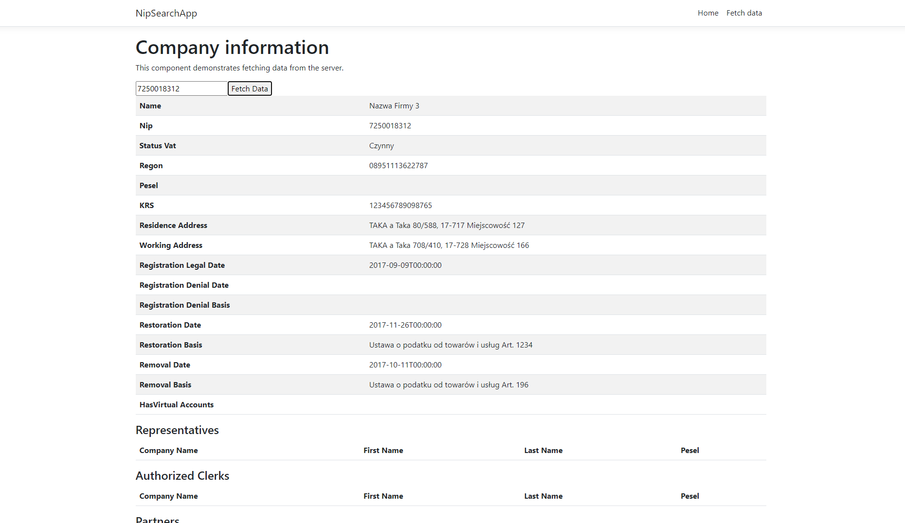

# NipSearchApp

> Celem aplikacji jest pobranie danych na podstawie nr NIP z wykorzystaniem api wykazu podatnikow vat.

## Spis treści
* [Informacje ogólne](#1)
* [Technologia](#2)
* [Dokumentacja](#4)
* [Przykład kodu](#5)
* [Kontakt](#6)

<a name="1"/>

## Informacje ogólne
Aplikacja pozwala na pobranie z api danych podatnika na podstawie podanego nr Nip.  
Dane są zapisywane w bazie danych oraz wyświetlane na ekranie interfejsu.  
Aplikacja podczas szukania sprawdza czy podmiot jest w bazie danych i pobiera istniejące już dane.  
[Dokumentacja API](https://www.gov.pl/web/kas/api-wykazu-podatnikow-vat)

<a name="2"/>

## Technologie
Typ Projektu - ASP.NET Core with React.Js  
Framework - .NET 6  
Wykorzystana baza - lokalna Ms SQL  

Zainstalowane paczki:
* Microsoft.AspNetCore.Mvc.NewtonsoftJson
* Microsoft.AspNetCore.SpaProxy
* Microsoft.EntityFrameworkCore
* Microsoft.EntityFrameworkCore.Design
* Microsoft.EntityFrameworkCore.SqlServer
* Microsoft.EntityFrameworkCore.Tools

<a name="4"/>

## Dokumentacja


<a name="5"/>

## Przykład kodu

*Pobranie danych dla istniejącego podatnika*
```csharp
 var task = _dataContext.Subject.Include(x=>x.accountNumbers)
                                 .Include(x=>x.authorizedClerks)
                                 .Include(x=>x.partners)
                                 .Include(x=>x.representatives)
                                 .Where(x => x.nip == id).FirstOrDefault();
```

*Pobranie danych z Api*
```csharp
var currentDate = DateTime.Now.GetDateTimeFormats();
var requestUrl = $"https://wl-test.mf.gov.pl/api/search/nip/{id}?date={currentDate[0]}";

HttpClient client = new HttpClient();
var response = await client.GetAsync(requestUrl);
var json = response.Content.ReadAsStringAsync().Result;
Root? entities = JsonSerializer.Deserialize<Root>(json);

var result = entities.result;
var subject = result.subject;

_dataContext.Subject.Add(subject);

try
{
    await _dataContext.SaveChangesAsync();
}
catch (System.Exception)
{

    throw;
}

return Ok(subject);
});
```

*Komponent dla modelu Entity Person*
```js
const EntityPerson = ({ data, title }) => {
    return (
        <>
            <h4 id="entityPerson">{title}</h4>
            <table className='table table-striped' aria-labelledby="tabelLabel">
                <thead>
                    <tr>
                        <th>Company Name</th>
                        <th>First Name</th>
                        <th>Last Name</th>
                        <th>Pesel</th>
                    </tr>
                </thead>
                <tbody>
                    {data.map(item => (
                        <tr key={item.nip}>
                            <td>{item.companyName}</td>
                            <td>{item.firstName}</td>
                            <td>{item.lastName}</td>
                            <td>{item.pesel}</td>
                        </tr>
                    ))}
                </tbody>
            </table>
        </>
    );
};

export default EntityPerson;
```

*Komponent dla pobierania danych podatnika*
```js
export class FetchData extends Component {
    static displayName = FetchData.name;

    constructor(props) {
        super(props);
        this.state = { companies: [], loading: true, inputValue: "" };
    }

    static renderCompaniesTable(company) {
        return (
            <>
                <table className='table table-striped' aria-labelledby="tabelLabel">
                    <tbody>
                        <TableRow label={"Name"} value={company.name }/>
                        <TableRow label={"Nip"} value={company.nip}/>
                        <TableRow label={"Status Vat"} value={company.statusVat}/>
                        <TableRow label={"Regon"} value={company.regon }/>
                        <TableRow label={"Pesel"} value={company.pesel }/>
                        <TableRow label={"KRS"} value={company.krs }/>
                        <TableRow label={"Residence Address"} value={company.residenceAddress }/>
                        <TableRow label={"Working Address"} value={company.workingAddress }/>
                        <TableRow label={"Registration Legal Date"} value={company.registrationLegalDate }/>
                        <TableRow label={"Registration Denial Date"} value={company.registrationDenialDate }/>
                        <TableRow label={"Registration Denial Basis"} value={company.registrationDenialBasis }/>
                        <TableRow label={"Restoration Date"} value={company.restorationDate }/>
                        <TableRow label={"Restoration Basis"} value={company.restorationBasis }/>
                        <TableRow label={"Removal Date"} value={company.removalDate }/>
                        <TableRow label={"Removal Basis"} value={company.removalBasis }/>
                        <TableRow label={"HasVirtual Accounts"} value={company.hasVirtualAccounts }/>
                    </tbody>
                </table>
                <EntityPerson data={company.representatives} title={"Representatives"}/>
                <EntityPerson data={company.authorizedClerks} title={"Authorized Clerks"}/>
                <EntityPerson data={company.partners} title={"Partners"} />

                <table className='table table-striped' aria-labelledby="tabelLabel">
                    <thead>
                        <tr>
                            <th>Account Numbers</th>
                        </tr>
                    </thead>
                    <tbody>
                        {company.accountNumbers.map(item => (
                            <tr key={item.id}>
                                <td>{item.number}</td>
                            </tr>
                        ))}
                    </tbody>
                </table>

            </>
        );
    }

    render() {
        let contents = this.state.loading
            ? <p><em>Loading...</em></p>
            : FetchData.renderCompaniesTable(this.state.companies);

        return (
            <div>
                <h1 id="tabelLabel" >Company information</h1>
                <p>This component demonstrates fetching data from the server.</p>
                <input type="text" value={this.state.inputValue} onChange={this.handleInputChange} />
                <button onClick={this.handleFetchData}>Fetch Data</button>
                {contents}
            </div>
        );
    }

    handleInputChange = (event) => {
        this.setState({ inputValue: event.target.value });
    };

    handleFetchData = () => {
        const { inputValue } = this.state;
        this.populateCompanyData(inputValue);
    };

    async populateCompanyData(nip) {
        const response = await fetch(`search/${nip}`);
        const data = await response.json();
        this.setState({ companies: data, loading: false });
    }
}
```
<a name="6"/>

## Kontakt
Aplikację stworzył:
Damian Jaszewski

